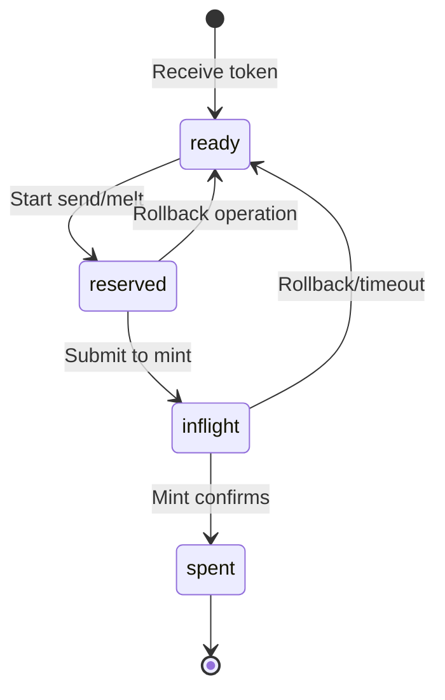
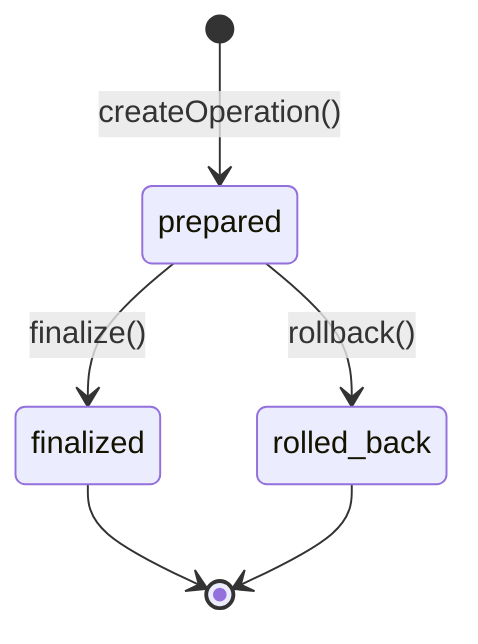

## Coco-Cashu Overview

Sovran uses [Coco-Cashu](https://github.com/cashubtc/coco-cashu) as its core Cashu implementation. Coco is a modular, TypeScript-native library built on top of `@cashu/cashu-ts`.

### Architecture

```
coco-cashu-core         # Core Cashu logic (Manager, APIs)
  ↓
coco-cashu-expo-sqlite  # SQLite repository layer for React Native
  ↓
coco-cashu-react        # React hooks (useManager, useBalance, etc.)
  ↓
Sovran app              # Composition layer (stores, custom hooks)
```

<Warning>
**Never import from `@cashu/cashu-ts` directly.** Always use coco packages. Coco wraps cashu-ts with better error handling, TypeScript types, and repository abstractions.
</Warning>

## CocoManager Singleton

The `CocoManager` class is a singleton wrapper around Coco's `Manager` that handles initialization, cleanup, and database management.

helper/coco/manager.ts:38-749

### Initialization Flow

The manager initializes in two phases:

**Phase 1: Blocking** (happens during app startup)

helper/coco/manager.ts:91-166

1. Open SQLite database (`coco.db` or `coco-N.db`)
2. Initialize repositories
3. Create seed getter (lazy - no crypto work yet)
4. Create NPC plugin (constructor only - no network)
5. Instantiate `Manager`

**Phase 2: Non-blocking** (happens after app is visible)

helper/coco/manager.ts:173-227

1. Run initial NPC sync (fetch Lightning addresses from npubx.cash)
2. Enable mint quote watcher
3. Enable mint quote processor
4. Enable proof state watcher

This two-phase approach ensures the app becomes interactive quickly (less than 1 second) while background tasks continue.

### Database Per Profile

Each profile gets its own SQLite database:

```tsx
// Account 0 (backward compatible)
CocoManager.setAccountIndex(0);
await CocoManager.initialize(); // Uses 'coco.db'

// Account 1
CocoManager.setAccountIndex(1);
await CocoManager.initialize(); // Uses 'coco-1.db'

// Account N
CocoManager.setAccountIndex(N);
await CocoManager.initialize(); // Uses 'coco-N.db'
```

helper/coco/manager.ts:59-67

Each database contains:
- **Proofs table** - Ecash proofs with state (ready, reserved, inflight, spent)
- **Mint quotes table** - Lightning → Cashu mint operations
- **Melt quotes table** - Cashu → Lightning melt operations
- **Keysets table** - Mint public keys for each unit (sat, usd, eur, etc.)
- **Mint info table** - Cached mint metadata

### Cleanup & Profile Switching

When switching profiles, the manager must be cleaned up:

helper/coco/manager.ts:250-289

This is called from the drawer layout before switching profiles:

app/(drawer)/_layout.tsx:102-102

## Proof Lifecycle

Proofs flow through several states:



### State Definitions

| State | Description | Can spend? |
|-------|-------------|------------|
| `ready` | Available for spending | ✅ |
| `reserved` | Reserved by an operation (send/melt) | ❌ |
| `inflight` | Submitted to mint, awaiting confirmation | ❌ |
| `spent` | Successfully spent, no longer usable | ❌ |

### Proof State Watcher

The **proof state watcher** monitors inflight proofs and updates their state based on mint responses:

```tsx
// Automatically checks inflight proofs every 5 seconds
await manager.enableProofStateWatcher();

// When a proof is confirmed spent:
// inflight → spent

// When a proof is still unspent:
// inflight → ready (returned to spendable balance)
```

This prevents "stuck balance" where proofs remain inflight forever after a failed transaction.

### Manual Proof Recovery

If proofs get stuck (e.g., due to a crash), users can manually free them:

helper/coco/manager.ts:510-707

This is exposed in Settings → Storage → "Free Reserved Balance".

## Mint Operations

### Adding a Mint

hooks/coco/useMintManagement.ts:33-51

Under the hood:
1. `manager.mint.trustMint(url)` fetches mint info
2. Stores keyset data in SQLite
3. Adds mint URL to trusted mints list
4. Returns mint metadata (name, icon, supported units)

### Mint Info

Mint metadata is cached in SQLite:

```tsx
const info = await manager.mint.getMintInfo(mintUrl);

// Returns:
interface MintInfo {
  name?: string;
  description?: string;
  icon_url?: string;
  contact?: { email?: string; nostr?: string };
  nuts: number[]; // Supported NUTs
}
```

### Keyset Management

Keysets define the denominations and units a mint supports:

```tsx
const keysets = await manager.mint.getKeysets(mintUrl);

// Returns array of keysets:
interface Keyset {
  id: string;        // Keyset ID (hash of keys)
  unit: string;      // 'sat', 'usd', 'eur', etc.
  active: boolean;   // Whether mint still issues this keyset
  keys: {
    [amount: string]: string; // amount → pubkey mapping
  };
}
```

Keysets are automatically refreshed on mint operations.

## Receiving Ecash

### Token Parsing

```tsx
import { buildReceiveHistoryEntry } from '@/helper/coco/utils';

const token = 'cashuAeyJ0b2tlbiI6...';
const historyEntry = buildReceiveHistoryEntry(token);

// historyEntry contains:
// - token: original token string
// - amount: total value in smallest unit
// - unit: 'sat', 'usd', etc.
// - mint: mint URL
// - memo: optional memo from sender
```

### Receiving Flow

```tsx
// 1. User scans/pastes token
const token = 'cashuAeyJ0b2tlbiI6...';

// 2. Navigate to receive screen
router.navigate({
  pathname: '/(receive-flow)/receiveToken',
  params: { 
    receiveHistoryEntry: JSON.stringify(buildReceiveHistoryEntry(token)) 
  }
});

// 3. Receive screen calls Coco to redeem
const result = await manager.wallet.receive({
  token,
  preferences: {
    // Optional: specify which proofs to keep
    counter: 0
  }
});

// 4. Proofs are now in 'ready' state, added to balance
```

### P2PK (Pay-to-Public-Key)

Sovran supports P2PK tokens that require a private key to unlock:

```tsx
// Generate P2PK receiving key
const { privateKey, publicKey } = await manager.wallet.generateP2PKKey();

// Create locked token request
const quote = await manager.quotes.createMintQuote({
  mintUrl,
  amount,
  unit: 'sat',
  pubkey: publicKey // Lock to this pubkey
});

// Receiver needs the private key to unlock:
const result = await manager.wallet.receive({
  token,
  privkey: privateKey // Unlocks P2PK proofs
});
```

P2PK keys are managed in Settings → Keyring.

## Sending Ecash

### Send Operation

hooks/coco/useSendWithHistory.ts creates a send operation:

```tsx
import { useSendWithHistory } from '@/hooks/coco/useSendWithHistory';

const { createOperation, finalize, rollback } = useSendWithHistory();

// 1. Create operation (reserves proofs)
const operation = await createOperation({
  mintUrl: 'https://mint.example.com',
  amount: 1000,
  unit: 'sat',
  memo: 'Coffee payment'
});

// 2. Finalize operation (creates token)
const token = await finalize(operation.id);

// 3. Share token with recipient
await Share.share({ message: token });

// If user cancels, rollback:
await rollback(operation.id); // Unreserves proofs
```

### Send States



### Pending Ecash Sweeper

Unredeemed sent tokens can be reclaimed:

```tsx
// Get all pending sends
const pending = await manager.send.getPendingOperations();

// Rollback each one
for (const op of pending) {
  await manager.send.rollback(op.id);
  // Proofs: reserved → ready (returned to spendable balance)
}
```

This is used in app/pendingEcash.tsx to sweep unclaimed sent tokens.

## Lightning Operations

### Minting (Lightning → Cashu)

```tsx
// 1. Create mint quote
const quote = await manager.quotes.createMintQuote({
  mintUrl: 'https://mint.example.com',
  amount: 10000, // sats
  unit: 'sat'
});

// quote contains:
// - quote: unique quote ID
// - request: Lightning invoice (BOLT11)
// - state: 'pending' | 'paid' | 'issued'
// - expiry: timestamp when quote expires

// 2. User pays invoice externally
await payLightningInvoice(quote.request);

// 3. Quote watcher detects payment, auto-mints proofs
// (or manually check and mint):
const proofs = await manager.quotes.mintTokens({
  mintUrl,
  quoteId: quote.quote
});
```

The **mint quote watcher** automatically checks pending quotes every 5 seconds and mints proofs when paid.

### Melting (Cashu → Lightning)

hooks/coco/useMeltWithHistory.ts handles melt operations:

```tsx
import { useMeltWithHistory } from '@/hooks/coco/useMeltWithHistory';

const { createOperation, finalize, rollback } = useMeltWithHistory();

// 1. Create melt quote
const quote = await manager.quotes.createMeltQuote({
  mintUrl: 'https://mint.example.com',
  request: 'lnbc10u1...', // BOLT11 invoice
  unit: 'sat'
});

// quote.amount is total cost (invoice amount + fee)

// 2. Create melt operation (reserves proofs)
const operation = await createOperation({
  mintUrl,
  quoteId: quote.quote,
  amount: quote.amount,
  unit: 'sat'
});

// 3. Finalize operation (pays invoice)
const result = await finalize(operation.id);

// result contains:
// - preimage: Lightning payment preimage (proof of payment)
// - state: 'paid' | 'failed'

// If failed, rollback:
await rollback(operation.id); // Unreserves proofs
```

### Lightning Addresses

Lightning addresses (user@domain.com) are resolved via LNURL-pay:

```tsx
import { isLightningAddress } from '@/helper/coco/utils';

if (isLightningAddress('user@domain.com')) {
  // 1. Fetch LNURL metadata
  const lnurl = await resolveLightningAddress('user@domain.com');
  
  // 2. Request invoice for amount
  const invoice = await lnurl.requestInvoice({ amount: 1000 });
  
  // 3. Create melt quote with invoice
  const quote = await manager.quotes.createMeltQuote({
    mintUrl,
    request: invoice,
    unit: 'sat'
  });
}
```

## Payment Requests (NUT-18)

hooks/coco/useProcessPaymentString.ts:216-331

Payment requests allow requesting ecash over Nostr without Lightning:

```tsx
import { decodePaymentRequest } from '@cashu/cashu-ts';

// creqA1234... format
const decoded = decodePaymentRequest('creqA1234...');

// decoded contains:
interface PaymentRequest {
  amount?: number;        // Requested amount
  unit?: string;          // 'sat', 'usd', etc.
  mints?: string[];       // Allowed mint URLs
  transport: {
    type: 'nostr';        // NUT-18 uses Nostr
    target: string;       // Nostr pubkey to send to
    tags?: string[][];    // Additional metadata
  }[];
}

// Sovran handles all routing automatically based on available data
```

## Mint Swapping & Rebalancing

### Swap Operation

```tsx
// Swap ecash from one mint to another
const result = await manager.wallet.swap({
  fromMintUrl: 'https://mint1.example.com',
  toMintUrl: 'https://mint2.example.com',
  amount: 5000,
  unit: 'sat'
});

// Under the hood:
// 1. Reserve proofs from mint1 (send operation)
// 2. Melt to Lightning invoice from mint2
// 3. Pay invoice, mint new proofs at mint2
// 4. Return new proofs
```

### Rebalance Planning

components/blocks/rebalance/rebalancePlanner.ts calculates optimal rebalance steps:

```tsx
interface RebalanceStep {
  from: string;      // Source mint URL
  to: string;        // Destination mint URL
  via?: string[];    // Middleman mints (if direct swap unavailable)
  amount: number;    // Amount to transfer
  unit: string;
}

const plan = calculateRebalancePlan({
  currentDistribution: { 'mint1': 8000, 'mint2': 2000 },
  targetDistribution: { 'mint1': 5000, 'mint2': 5000 },
  swapEdges: [...],  // Available swap pairs from auditor
  minTransfer: 100   // Minimum transfer amount
});

// Returns array of steps to execute
```

### Middleman Routing

If two mints don't support direct swaps, Sovran can route through intermediary mints:

```tsx
// Settings → Routing
const routingSettings = useSettingsStore(s => s.middlemanRouting);

interface MiddlemanRoutingSettings {
  maxHops: number;           // Max intermediaries (1 = A→via→B)
  maxFee: number;            // Max total fee in sats
  minSuccessRate: number;    // Min success rate (0-1)
  requireLastOk: boolean;    // Most recent swap must be OK
  trustMode: 'trusted_only' | 'allow_untrusted';
}

// Example: A → B (no direct swap)
// Route: A → via1 → B (1 hop)
// Route: A → via1 → via2 → B (2 hops)
```

components/blocks/rebalance/routing.ts implements the routing algorithm.

## NPC Plugin (npubx.cash)

The **NPC plugin** integrates with [npubx.cash](https://npubx.cash) for Lightning addresses:

```tsx
// Configured in CocoManager initialization
const npcPlugin = new NPCPlugin(
  'https://npubx.cash',
  signerFunction,
  {
    syncIntervalMs: 30000,  // Sync every 30s
    useWebsocket: true      // Real-time updates
  }
);

// Plugin handles:
// 1. Claiming Lightning addresses (you@npubx.cash)
// 2. Receiving payments to your address
// 3. Auto-minting received payments
```

NPC sync runs in the non-blocking initialization phase.

## React Hooks

coco-cashu-react provides hooks for common operations:

```tsx
import { 
  useManager,         // Access Manager instance
  useBalance,         // Get balance per mint/unit
  useBalanceContext,  // Subscribe to balance changes
  useMints,           // Get trusted mints list
  useHistory          // Get transaction history
} from 'coco-cashu-react';

// Usage
const manager = useManager();
const { balance } = useBalanceContext();
const { trustedMints } = useMints();
```

Sovran wraps these in custom hooks in `hooks/coco/`:

| Hook | Purpose |
|------|----------|
| `useMintManagement` | Add/remove mints, get mint info |
| `useSendWithHistory` | Send operations with history tracking |
| `useMeltWithHistory` | Melt operations with history tracking |
| `useLightningOperations` | Lightning invoice operations |
| `useProcessPaymentString` | Parse and route payment strings (QR/NFC/paste) |
| `useHistoryWithMelts` | Combined history (sends + melts) |
| `useAuditedMint` | Fetch audit data for a mint |
| `useKYMMint` | Fetch KYM ratings for a mint |

## Best Practices

<AccordionGroup>
  <Accordion title="Always use Coco hooks in components">
    Never call Manager methods directly in components - use hooks:
    
    ```tsx
    // Good ✅
    const { addMint, isLoading } = useMintManagement();
    await addMint('https://mint.example.com');
    
    // Bad ❌
    const manager = useManager();
    await manager.mint.trustMint('https://mint.example.com');
    ```
  </Accordion>
  
  <Accordion title="Handle proof state transitions">
    Always handle rollback when operations fail:
    
    ```tsx
    const { createOperation, finalize, rollback } = useSendWithHistory();
    
    try {
      const op = await createOperation({ ... });
      const token = await finalize(op.id);
      // Success - proofs are spent
    } catch (error) {
      await rollback(op.id); // Return proofs to spendable balance
    }
    ```
  </Accordion>
  
  <Accordion title="Check keyset support before operations">
    Ensure the mint supports the unit you want to use:
    
    ```tsx
    const keysets = await manager.mint.getKeysets(mintUrl);
    const supportsUnit = keysets.some(k => k.unit === 'usd' && k.active);
    
    if (!supportsUnit) {
      throw new Error('Mint does not support USD');
    }
    ```
  </Accordion>
  
  <Accordion title="Monitor quote states">
    Don't assume quotes succeed immediately:
    
    ```tsx
    const quote = await manager.quotes.createMintQuote({ ... });
    
    // Wait for payment
    const checkQuote = async () => {
      const updated = await manager.quotes.checkMintQuote(quote.quote);
      if (updated.state === 'paid') {
        // Mint tokens
        await manager.quotes.mintTokens({ ... });
      }
    };
    
    // Or let the quote watcher handle it automatically
    ```
  </Accordion>
</AccordionGroup>

## Related Documentation

<CardGroup cols={2}>
  <Card title="State Management" href="/architecture/state-management" icon="database">
    Learn about stores that complement Coco's SQLite storage
  </Card>
  
  <Card title="Nostr Integration" href="/architecture/nostr-integration" icon="satellite-dish">
    See how Nostr payment requests integrate with Cashu
  </Card>
</CardGroup>