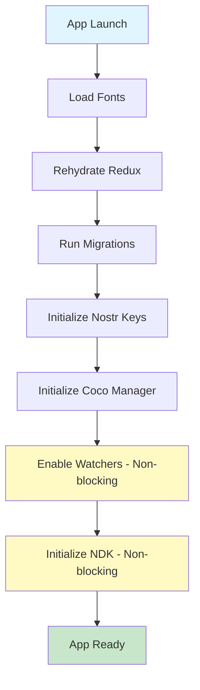

## System Architecture

Sovran is a React Native mobile wallet built on Expo, designed around the Cashu ecash protocol with deep Nostr integration. The architecture follows a layered approach with clear separation of concerns.

### Technology Stack

**Core Framework**
- **React Native 0.83** with **Expo SDK 55** for cross-platform mobile development
- **Expo Router** for file-based routing and navigation
- **TypeScript** for type safety across the codebase

**UI & Styling**
- **HeroUI Native** for primitive components
- **Uniwind** (Tailwind v4 for React Native) for styling
- **Reanimated 4.2** for animations and hero transitions
- **37 custom themes** with color palettes and background images

**State Management**
- **Zustand** for modern state management (migrating from Redux)
- **Redux** with redux-persist (legacy, being phased out)
- **AsyncStorage** for persisted state
- **expo-secure-store** for sensitive data (mnemonics, keys)

**Protocols & Standards**

<CardGroup cols={2}>
  <Card title="Cashu (Ecash)" icon="coins">
    - NUT-00 through NUT-13
    - NUT-17 (WebSockets)
    - NUT-18 (Payment requests)
    - NUT-23 (Backup/restore)
  </Card>
  
  <Card title="Nostr" icon="satellite-dish">
    - NIP-04 (Encrypted DMs)
    - NIP-05 (DNS verification)
    - NIP-06 (Key derivation)
    - NIP-17, NIP-44, NIP-59 (Gift-wrapped DMs)
    - NIP-19 (Bech32 encoding)
  </Card>
  
  <Card title="Bitcoin" icon="bitcoin-sign">
    - Lightning Network (BOLT11)
    - BIP-39 (Mnemonic seed phrases)
    - BIP-32 (HD wallets)
  </Card>
  
  <Card title="Other" icon="plug">
    - NFC (NDEF Type 4 Tag protocol)
    - UR codes (multi-frame QR)
    - Lightning addresses
    - LNURL-pay
  </Card>
</CardGroup>

## Code Organization

The codebase follows a clear directory structure optimized for scalability:

```
source/
├── app/                    # Expo Router file-based routes
│   ├── _layout.tsx        # Root layout with providers
│   ├── (drawer)/          # Main app drawer navigation
│   │   └── (tabs)/        # Tab bar navigation (Feed, Wallet, Payments, Explore)
│   ├── (send-flow)/       # Send payment flow
│   ├── (receive-flow)/    # Receive payment flow
│   ├── (mint-flow)/       # Mint management flow
│   ├── (user-flow)/       # User profile & messaging
│   ├── (map-flow)/        # BTCMap integration
│   └── settings-pages/    # Settings screens
├── components/
│   ├── ui/                # Primitives (Text, Button, etc.)
│   └── blocks/            # Composed product UI components
├── hooks/                 # Reusable React hooks
│   └── coco/              # Cashu-specific hook compositions
├── helper/                # Stateless utility functions
│   └── coco/              # Cashu integration glue code
├── stores/                # Zustand stores (global & profile-scoped)
├── providers/             # React context providers
├── redux/                 # Legacy Redux store (being migrated out)
└── .cursor/rules/         # Agent-facing architecture documentation
```

<Info>
**Principle**: `app/` contains thin orchestration screens. Business logic lives in `hooks/`, `helper/`, and `stores/`. UI primitives in `components/ui/`, product features in `components/blocks/`.
</Info>

## Provider Hierarchy

app/_layout.tsx:1-334

The app initializes through a carefully ordered provider hierarchy:

### Outer Providers (Stable)

These providers never remount, even across profile switches:

1. **KeyboardProvider** - Keyboard controller setup
2. **InitializationProvider** - Splash screen & initialization state
3. **PersistGate** - Redux rehydration (legacy)
4. **Provider** (Redux) - Redux store (legacy)
5. **ThemeProvider** - Theme context & dynamic colors
6. **HeroUINativeProvider** - HeroUI component library
7. **HeroTransitionProvider** - Shared element transitions

### Inner Providers (Account-Scoped)

These providers remount when switching profiles (via React `key` change):

1. **MigrationGate** - Database migrations & version checks
2. **NostrKeysProvider** - BIP-39 seed → Nostr key derivation (NIP-06)
3. **NostrNDKProvider** - NDK initialization with SQLite cache
4. **CocoProvider** - Coco-Cashu manager initialization
5. **ActionSheetProvider** - Bottom sheet UI framework
6. **SheetProvider** - Sheet registry
7. **PricelistProvider** - Fiat price data (USD/EUR/GBP)
8. **PasscodeGate** - 4-digit PIN protection
9. **AppGate** - Terms acceptance & onboarding

<Warning>
Inner providers are remounted on profile switch to ensure complete isolation between user accounts. This includes closing database connections, clearing caches, and rederiving all keys.
</Warning>

## Profile Management

Sovran supports multiple user profiles (wallets) derived from a single BIP-39 mnemonic:

- **Account 0** uses `coco.db` and `nostr` (backward compatible)
- **Account N** uses `coco-N.db` and `nostr-N` for database isolation
- Each profile has its own:
  - Nostr identity (NIP-06 derivation path: `m/44'/1237'/0'/0/{accountIndex}`)
  - Cashu wallet seed (BIP-32 path: `m/44'/129372'/0'/{accountIndex}'/0/0`)
  - SQLite database for proofs, quotes, and history
  - Zustand store state (persisted to profile-scoped AsyncStorage keys)

**Profile switching flow** (app/(drawer)/_layout.tsx:89-119):
1. Close drawer
2. Show loading screen
3. Cleanup Coco manager & disable watchers
4. Switch `activeAccountIndex` in profileStore
5. Rehydrate all profile-scoped Zustand stores
6. React `key` change in `_layout.tsx` triggers full provider remount

## Key Management

All cryptographic material derives from a single BIP-39 mnemonic stored in expo-secure-store:

providers/NostrKeysProvider.tsx:244-378

**Derivation paths:**

| Purpose | Standard | Path | Output |
|---------|----------|------|--------|
| Nostr identity | NIP-06 | `m/44'/1237'/0'/0/{account}` | nsec/npub |
| Cashu wallet | BIP-32 (NUT-13) | `m/44'/129372'/0'/{account}'/0/0` | 12-word mnemonic |

**Key caching:**
- Derived keys are cached in expo-secure-store to avoid expensive re-derivation
- Cache is validated via mnemonic hash - invalidated on mnemonic change
- Fast path: less than 5ms to load from cache
- Slow path: ~200ms for full NIP-06 + BIP-32 derivation

## Data Persistence

Sovran uses multiple storage layers:

| Layer | Technology | Scope | Use Case |
|-------|-----------|-------|----------|
| **Secure Storage** | expo-secure-store (encrypted) | Global | Mnemonics, derived keys, passcodes |
| **Cashu Proofs** | expo-sqlite via coco-cashu-expo-sqlite | Per-profile | Ecash proofs, mint quotes, keyset data |
| **Nostr Events** | expo-sqlite via NDK | Per-profile | Cached Nostr events, profiles, messages |
| **App State** | AsyncStorage via Zustand | Global or per-profile | Settings, balances, scan history |
| **Redux** | AsyncStorage via redux-persist | Global | Legacy state (being migrated out) |

<Note>
**Profile-scoped stores** use AsyncStorage keys like `mint-store-profile-0`, `mint-store-profile-1`, etc. Global stores use simple keys like `settings-store`.
</Note>

## Initialization Flow

The app follows a staged initialization process to minimize perceived load time:



**Blocking stages** (prevent app from showing):
- Font loading
- Redux rehydration
- Database migrations
- Nostr key derivation
- Coco Manager instantiation

**Non-blocking stages** (happen after app is visible):
- Mint quote watcher
- Proof state watcher
- NDK initialization with relay connections
- NPC plugin sync (npubx.cash Lightning addresses)

This approach ensures the app becomes interactive in less than 1 second on most devices, while background tasks continue to load.

## Next Steps

<CardGroup cols={2}>
  <Card title="Routing" href="/architecture/routing" icon="route">
    Learn about Expo Router file-based navigation structure
  </Card>
  
  <Card title="State Management" href="/architecture/state-management" icon="database">
    Zustand stores, Redux migration, and profile-scoped state
  </Card>
  
  <Card title="Cashu Integration" href="/architecture/cashu-integration" icon="coins">
    Coco-Cashu manager, proofs, quotes, and mint operations
  </Card>
  
  <Card title="Nostr Integration" href="/architecture/nostr-integration" icon="satellite-dish">
    NDK, gift-wrapped DMs, and social graph integration
  </Card>
</CardGroup>