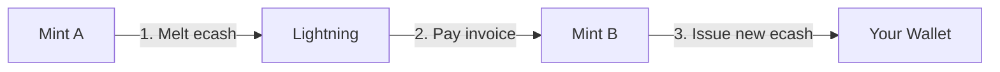
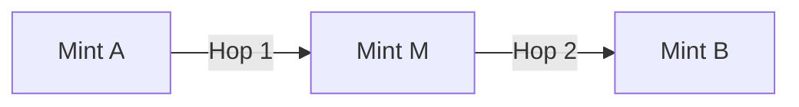

## Overview

Mint swapping enables you to move ecash from one mint to another using the Lightning Network as an intermediary. This is essential for:

- **Rebalancing** - Redistributing funds across mints
- **Exit strategy** - Moving funds from untrusted mints
- **Liquidity management** - Consolidating or spreading balances

## How Swapping Works

### Direct Swap (Single Hop)



1. **Create invoice** on destination mint (Mint B)
2. **Melt ecash** from source mint (Mint A) to pay invoice
3. **Receive ecash** from destination mint

### Code Example

```typescript
import { useManager } from 'coco-cashu-react';
import { useLightningOperations } from '@/hooks/coco/useLightningOperations';

async function swapMints({
  fromMintUrl,
  toMintUrl,
  amount
}: {
  fromMintUrl: string;
  toMintUrl: string;
  amount: number;
}) {
  const manager = useManager();
  const { requestLightningInvoice } = useLightningOperations();
  
  // 1. Create invoice on destination mint
  const mintQuote = await requestLightningInvoice(toMintUrl, amount);
  const invoice = mintQuote.request;
  
  // 2. Prepare melt on source mint (gets fee quote)
  const preparedMelt = await manager.quotes.prepareMeltBolt11(
    fromMintUrl, 
    invoice
  );
  
  // 3. Execute melt (pays invoice)
  const result = await manager.quotes.executeMelt(preparedMelt.id);
  
  // 4. Destination mint automatically issues ecash when invoice is paid
  // MintQuoteProcessor claims it periodically (every 5 seconds)
}
```

## Fee Handling

Swaps involve multiple fee layers:

### Fee Components

```typescript
interface SwapFees {
  // Source mint fees
  meltFeeReserve: number;  // Lightning payment fee buffer
  swapFee: number;         // Per-proof input fees
  
  // Lightning network fees
  routingFee: number;      // Varies by route
  
  // Destination mint fees
  mintFee: number;         // Usually 0 for receiving
}
```

### Dynamic Fee Headroom

Sovran calculates fee headroom dynamically to avoid "not enough proofs" errors:

```typescript
const MIN_FEE_RESERVE = 3; // Base reserve

// Calculate worst-case input fee from actual proof set
const proofs = await manager.proofService.getReadyProofs(fromMintUrl);
const wallet = await manager.walletService.getWallet(fromMintUrl);
const worstCaseInputFee = wallet.getFeesForProofs(proofs);

// Total headroom: reserve + input fees
const feeHeadroom = Math.max(
  MIN_FEE_RESERVE + 2,  // Static fallback: 5 sats
  MIN_FEE_RESERVE + worstCaseInputFee
);

// Cap transfer amount to leave room for fees
const transferAmount = sourceBalance - feeHeadroom;
```

### Fee Probing

Before executing, probe the actual fee_reserve:

```typescript
// Probe melt quote to discover real fee_reserve
const probeWallet = await manager.walletService.getWallet(fromMintUrl);
const probeQuote = await probeWallet.createMeltQuoteBolt11(invoice);
const actualFeeReserve = Number(probeQuote.fee_reserve ?? 0);

// Adjust headroom if probed value is higher
if (actualFeeReserve > 0) {
  feeHeadroom = Math.max(
    feeHeadroom,
    actualFeeReserve + worstCaseInputFee
  );
}
```

## Middleman Routing

When direct Lightning routes fail, Sovran automatically routes through intermediary mints:

### Routing Strategy



**When to use:**
- `no_route` error on direct swap
- Insufficient Lightning liquidity
- Geographic routing constraints

**How it works:**
1. Detect `no_route` error during melt
2. Query auditor API for successful swap pairs
3. Build graph of mint connections
4. Use BFS to find path from source to destination
5. Execute chain of swaps (A → M → B)

### Routing Implementation

```typescript
import { 
  buildSwapGraph,
  pickIntermediaryPath,
  addLocalHistoryEdges 
} from 'components/blocks/rebalance/routing';

// Build graph from auditor data
const audits = await Promise.all(
  candidateMints.map(url => fetchAudit(url))
);
const graph = buildSwapGraph(audits);

// Merge local swap history
const swapGroups = useSwapTransactionsStore.getState().groups;
addLocalHistoryEdges(graph, Object.values(swapGroups));

// Find best path
const result = pickIntermediaryPath({
  from: fromMintUrl,
  to: toMintUrl,
  graph,
  settings: middlemanRouting,  // User preferences
  trustedMintUrls: new Set(trustedMints)
});

if (result.path) {
  // result.path: ['https://mint-a.com', 'https://mint-m.com', 'https://mint-b.com']
  console.log('Route:', result.pathNames.join(' → '));
}
```

### Trust Management for Routing

Intermediaries are temporarily trusted during routing:

```typescript
const temporarilyTrusted: string[] = [];

// Trust intermediaries
for (const url of intermediaries) {
  if (!trustedMintUrls.has(url)) {
    await manager.mint.addMint(url);
    await manager.mint.trustMint(url);
    temporarilyTrusted.push(url);
  }
}

// Execute chain...

// Untrust intermediaries (if no funds remain)
for (const url of temporarilyTrusted) {
  const balance = (await manager.wallet.getBalances())[url] || 0;
  if (balance === 0) {
    await manager.mint.untrustMint(url);
  }
}
```

## Swap Transactions Store

Swaps are tracked in `swapTransactionsStore.ts` for history and correlation:

### Data Structure

```typescript
interface SwapGroup {
  id: string;
  unit: string;
  createdAt: number;
  title: string;
  state: 'running' | 'finished' | 'cancelled';
  legs: SwapLeg[];
}

interface SwapLeg {
  id: string;
  fromMintUrl: string;
  toMintUrl: string;
  amount: number;
  
  // Correlation IDs
  mintQuoteId?: string;
  meltQuoteId?: string;
  meltOperationId?: string;
  
  // Middleman chain metadata
  chainId?: string;
  chainPath?: string[];        // Full path of mint URLs
  chainHopIndex?: number;      // Position in chain
  
  // UI state
  localStatus?: SwapLegLocalStatus;
  errorMessage?: string;
}

type SwapLegLocalStatus = 
  | 'pending'
  | 'creatingInvoice'
  | 'invoiceReady'
  | 'melting'
  | 'verifying'
  | 'done'
  | 'failed';
```

### Usage Example

```typescript
import { useSwapTransactionsStore } from 'stores/swapTransactionsStore';

// Start a swap group
const groupId = useSwapTransactionsStore.getState().startGroup({
  unit: 'sat',
  title: 'Rebalance'
});

// Add a leg
const legId = useSwapTransactionsStore.getState().addLeg(groupId, {
  fromMintUrl: 'https://mint-a.com',
  toMintUrl: 'https://mint-b.com',
  amount: 1000
});

// Tag with quote IDs (for correlation)
useSwapTransactionsStore.getState().tagMintQuote(groupId, legId, mintQuoteId);
useSwapTransactionsStore.getState().tagMelt(groupId, legId, {
  quoteId: meltQuoteId,
  operationId: meltOperationId
});

// Update status
useSwapTransactionsStore.getState().setLegStatus(groupId, legId, {
  localStatus: 'melting'
});

// Finalize
useSwapTransactionsStore.getState().finalizeGroup(groupId, 'finished');
```

### Viewing Swap History

Swap transactions appear in the transactions list:

```typescript
import { SwapTransactionScreen } from 'components/screens/SwapTransactionScreen';

// Navigate to swap details
router.navigate({
  pathname: '/(transactions-flow)/swap',
  params: { groupId }
});
```

## Error Handling

### Common Errors

```typescript
try {
  await swapMints({ fromMintUrl, toMintUrl, amount });
} catch (err) {
  const message = err.message;
  
  if (message.includes('no_route') || message.includes('FAILURE_REASON_NO_ROUTE')) {
    // Try middleman routing
  } else if (message.includes('Not enough proofs')) {
    // Reduce amount and retry
  } else if (message.includes('lnd is not ready')) {
    // Mint Lightning node is offline
  } else if (message.includes('FAILURE_REASON_TIMEOUT')) {
    // Lightning payment timed out
  } else if (message.includes('insufficient')) {
    // Insufficient balance
  }
}
```

### Retry Logic

```typescript
const MAX_RETRIES = 5;
const RETRY_REDUCE_SATS = 2;

for (let attempt = 0; attempt <= MAX_RETRIES; attempt++) {
  try {
    const prepared = await manager.quotes.prepareMeltBolt11(fromMintUrl, invoice);
    break; // Success
  } catch (err) {
    if (err.message.includes('Not enough proofs') && attempt < MAX_RETRIES) {
      // Reduce amount and retry
      amount -= RETRY_REDUCE_SATS;
      invoice = await createInvoiceForAmount(amount);
      continue;
    }
    throw err;
  }
}
```

### Proof Recovery

If a swap fails, restore "inflight" proofs:

```typescript
import { CocoManager } from 'helper/coco/manager';

try {
  await swapMints(params);
} catch (err) {
  // Restore proofs stuck in "inflight" state
  await CocoManager.restoreInflightProofsForMint(fromMintUrl);
  throw err;
}
```

## Pending State Handling

Some mints use async Lightning payments:

```typescript
const result = await manager.quotes.executeMelt(preparedMelt.id);

if (result?.state === 'pending') {
  const opId = result.id ?? preparedMelt.id;
  const maxWait = 20000; // 20 seconds
  const start = Date.now();
  
  while (Date.now() - start < maxWait) {
    const decision = await manager.quotes.checkPendingMelt(opId);
    
    if (decision === 'finalize') {
      // Payment succeeded
      break;
    } else if (decision === 'rollback') {
      // Payment failed
      throw new Error('Payment rolled back');
    }
    
    await new Promise(resolve => setTimeout(resolve, 2000));
  }
  
  throw new Error('Payment pending - will auto-recover');
}
```

## Balance Verification

After swapping, verify the destination mint received funds:

```typescript
async function waitForBalanceIncrease(
  mintUrl: string,
  expectedIncrease: number,
  maxWaitMs: number = 15000
) {
  const initialBalances = await manager.wallet.getBalances();
  const startBalance = initialBalances[mintUrl] || 0;
  const startTime = Date.now();
  
  while (Date.now() - startTime < maxWaitMs) {
    await new Promise(resolve => setTimeout(resolve, 1000));
    
    const currentBalances = await manager.wallet.getBalances();
    const currentBalance = currentBalances[mintUrl] || 0;
    
    // Allow for fee variance
    if (currentBalance > startBalance) {
      return true;
    }
  }
  
  return false;
}

// Usage
const balanceUpdated = await waitForBalanceIncrease(toMintUrl, amount, 15000);
if (!balanceUpdated) {
  console.warn('Balance not updated within timeout');
}
```

## UI Components

### Transfer Step Row

```typescript
import { RebalanceStepRow } from 'components/blocks/rebalance';

<RebalanceStepRow
  step={{
    id: 'step-1',
    fromMintUrl: 'https://mint-a.com',
    toMintUrl: 'https://mint-b.com',
    amount: 1000
  }}
  stepState={{
    status: 'melting',
    errorMessage: undefined
  }}
  mintInfoMap={mintInfoMap}
/>
```

### Chain Card (Middleman Route)

```typescript
import { RebalanceChainCard } from 'components/blocks/rebalance';

<RebalanceChainCard
  chain={{
    id: 'chain-1',
    path: ['mint-a', 'mint-m', 'mint-b'],
    steps: [/* ... */]
  }}
  stepStates={stepStates}
  mintInfoMap={mintInfoMap}
/>
```

## Best Practices

<AccordionGroup>
  <Accordion title="Check Liquidity First">
    Before swapping large amounts, verify both mints have sufficient Lightning liquidity. Check recent swap success rates in audit data.
  </Accordion>
  
  <Accordion title="Use Minimum Transfer Threshold">
    Set a minimum threshold (e.g., 10 sats) to avoid paying fees on tiny swaps:
    ```typescript
    const minTransferThreshold = 10;
    if (amount < minTransferThreshold) {
      throw new Error('Amount below minimum threshold');
    }
    ```
  </Accordion>
  
  <Accordion title="Monitor Routing Preferences">
    Configure middleman routing behavior in settings:
    ```typescript
    const middlemanRouting = useSettingsStore(state => state.middlemanRouting);
    // Options: 'auto', 'ask', 'never'
    ```
  </Accordion>
  
  <Accordion title="Handle Concurrency">
    Avoid running multiple swaps from the same mint simultaneously - use an execution lock to prevent "melt already in progress" errors.
  </Accordion>
</AccordionGroup>

## Related Documentation

<CardGroup cols={2}>
  <Card title="Wallet Rebalancing" icon="scale-balanced" href="/cashu/wallet-rebalancing">
    Automated multi-mint rebalancing
  </Card>
  
  <Card title="Know Your Mint" icon="shield-check" href="/cashu/know-your-mint">
    Check mint reliability before swapping
  </Card>
</CardGroup>