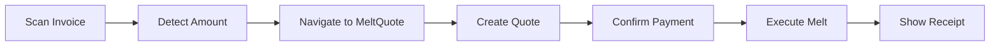
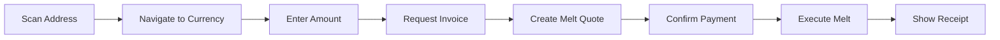

## Overview

Sovran integrates Lightning Network payments through the Cashu protocol's melt/mint operations. Users can pay Lightning invoices, send to Lightning addresses, and handle LNURL-pay requests.

## Payment String Processing

The `useProcessPaymentString` hook (`hooks/coco/useProcessPaymentString.ts`) handles all Lightning payment formats:

### Supported Formats

1. **Lightning invoices** (BOLT11)
2. **Lightning addresses** (user@domain.com)
3. **LNURL-pay URLs** (lnurlp://...)
4. **Ecash tokens** (cashuA...)
5. **NUT-18 payment requests** (creqA...)
6. **HTTP/HTTPS mint URLs**
7. **Nostr pubkeys** (npub...)

### Invoice Detection

```typescript
if (
  (isLightningAddress(lnTrim(scanning.data)) ||
    isLnurlp(lnTrim(scanning.data)) ||
    isLightningInvoice(lnTrim(scanning.data))) &&
  selectedMint
) {
  const trimmedData = lnTrim(scanning.data);
  const amount = getLightningAmount(trimmedData);
  const isInvoice = isLightningInvoice(trimmedData);

  addScan(scanning.data, trimmedData, 'lightning', source);

  if (isInvoice && amount) {
    // Direct navigation to melt quote screen
    router.navigate({
      pathname: '/(send-flow)/meltQuote',
      params: { invoice: trimmedData },
    });
    return { urInProgress: false };
  }

  // Lightning address/LNURL without amount
  router.navigate({
    pathname: '/(send-flow)/currency',
    params: {
      to: 'meltQuote',
      lnUrlOrAddress: trimmedData,
      unit,
    },
  });
}
```

From `hooks/coco/useProcessPaymentString.ts:333-367`.

## Lightning Utilities

### Invoice Parsing

The `helper/coco/utils.ts` module provides Lightning invoice utilities:

#### Extract Amount

```typescript
export function getLightningAmount(invoice: string): number {
  try {
    const decoded = decode(invoice);
    const amount = decoded?.sections?.find((route) => route?.name === 'amount')?.value;
    return amount ? amount / 1000 : 0; // Convert millisats to sats
  } catch {
    return 0;
  }
}
```

#### Extract Timestamp

```typescript
export function getLightningTimestamp(invoice: string): number {
  try {
    const decoded = decode(invoice);
    const timestamp = decoded?.sections?.find((route) => route?.name === 'timestamp')?.value;
    return timestamp || 0;
  } catch {
    return 0;
  }
}
```

#### Validate Invoice

```typescript
export const isLightningInvoice = (invoice: string): boolean => {
  try {
    decode(invoice);
    return true;
  } catch {
    return false;
  }
};
```

### URI Trimming

Normalizes Lightning URIs by removing common prefixes:

```typescript
export function lnTrim(str: string) {
  if (!str || !_.isString(str)) {
    return '';
  }
  str = str.trim().toLowerCase();
  const uriPrefixes = [
    'lightning:',
    'lightning=',
    'lightning://',
    'lnurlp://',
    'lnurlp=',
    'lnurlp:',
    'lnurl:',
    'lnurl=',
    'lnurl://',
  ];
  uriPrefixes.forEach((prefix) => {
    if (!str.startsWith(prefix)) {
      return;
    }
    str = str.slice(prefix.length).trim();
  });
  return str.trim();
}
```

From `helper/coco/utils.ts:162-185`.

## LNURL Support

### Lightning Address Validation

```typescript
const LN_ADDRESS_REGEX =
  /^((?:[^<>()[\]\\.,;:\s@"]+(?:\.[^<>()[\]\\.,;:\s@"]+)*)|(?:".+"))@((?:\[[0-9]{1,3}\.[0-9]{1,3}\.[0-9]{1,3}\.[0-9]{1,3}\])|(?:(?:[a-zA-Z\-0-9]+\.)+[a-zA-Z]{2,}))$/;

export const isLightningAddress = (address: string): boolean => {
  if (!address) return false;
  return LN_ADDRESS_REGEX.test(address);
};
```

### LNURL-Pay URL Validation

```typescript
const LNURLP_REGEX = /^lnurlp:\/\/([\w-]+\.)+[\w-]+(:\d{1,5})?(\/[\w-./?%&=]*)?$/;

export const isLnurlp = (url: string): boolean => {
  if (!url) return false;
  return LNURLP_REGEX.test(url);
};
```

### Request Invoice from LNURL

```typescript
export const requestInvoiceFromLnurl = async (
  lnUrlOrAddress: string,
  amountSats: number
): Promise<string> => {
  const params = await getLnurlPayParams(lnUrlOrAddress);
  if (!params || !params.callback) {
    throw new Error('Invalid LNURL or lightning address');
  }

  const amountMsats = amountSats * 1000;

  if (amountMsats < params.minSendable || amountMsats > params.maxSendable) {
    throw new Error(
      `Amount must be between ${params.minSendable / 1000} and ${params.maxSendable / 1000} sats`
    );
  }

  const response = await fetch(`${params.callback}?amount=${amountMsats}`);
  const data = await response.json();

  if (!data.pr) {
    throw new Error('No invoice returned from LNURL endpoint');
  }

  return data.pr;
};
```

From `helper/coco/utils.ts:284-309`.

## Melt Operations

The `useMeltWithHistory` hook manages Lightning payment execution:

```typescript
import type { MeltQuoteBolt11Response } from '@cashu/cashu-ts';
import type { MeltHistoryEntry } from 'coco-cashu-core';
import { useManager } from 'coco-cashu-react';
```

### Melt Flow

1. **Prepare melt quote** - Get quote from mint for invoice amount + fees
2. **Execute melt** - Burn ecash tokens and pay Lightning invoice
3. **Track history** - Record melt operation in transaction history
4. **Handle errors** - Rollback on failure, preserve tokens

From `hooks/coco/useMeltWithHistory.ts:1-12`.

## Payment Flows

### Direct Invoice Payment

When scanning an invoice with an amount:



### Lightning Address Payment

When sending to a Lightning address:



## NFC Lightning Detection

NFC payments can detect Lightning invoices and redirect to the appropriate flow:

```typescript
// From helper/nfc/payment.ts:198-212
const trimmedForLightning = lnTrim(paymentRequest);
if (isLightningInvoice(trimmedForLightning)) {
  log('Lightning invoice detected via NFC');
  const lnAmount = getLightningAmount(trimmedForLightning);
  if (onLightningInvoice) {
    await releaseNfc();
    onLightningInvoice(trimmedForLightning, lnAmount);
    return { paymentRequest, mintUrl: '', amount: lnAmount };
  }
  throw new NfcError(
    'Lightning invoice detected. Please use the Lightning payment flow.',
    'LIGHTNING_INVOICE_DETECTED'
  );
}
```

## Lightning Operations Hook

The `useLightningOperations` hook provides high-level Lightning operations:

```typescript
import { useManager } from 'coco-cashu-react';

export function useLightningOperations() {
  const manager = useManager();
  
  // Provides:
  // - createMeltQuote(mintUrl, invoice)
  // - executeMelt(quoteId)
  // - checkMeltStatus(quoteId)
  // - cancelMelt(quoteId)
}
```

From `hooks/coco/useLightningOperations.ts:3`.

## Scan History Integration

All Lightning scans are tracked:

```typescript
addScan(scanning.data, trimmedData, 'lightning', source);
```

Scan sources include:
- `qr` - QR code scanner
- `paste` - Clipboard paste
- `deeplink` - App deep link
- `nfc` - NFC tap payment

## Key Features

<CardGroup cols={2}>
  <Card title="BOLT11 Support" icon="bolt">
    Full support for Lightning invoices with amount extraction and validation
  </Card>
  
  <Card title="LNURL Integration" icon="link">
    Native LNURL-pay and Lightning address support without external libraries
  </Card>
  
  <Card title="Automatic Routing" icon="route">
    Smart routing based on invoice amount and mint availability
  </Card>
  
  <Card title="NFC Detection" icon="nfc-symbol">
    Automatic detection and handling of Lightning invoices via NFC
  </Card>
</CardGroup>

## Related Documentation

- [Ecash Tokens](/features/ecash-tokens) - Cashu token handling
- [NFC Payments](/features/nfc-payments) - NFC payment flows
- [QR Scanner](/features/qr-scanner) - QR code scanning
