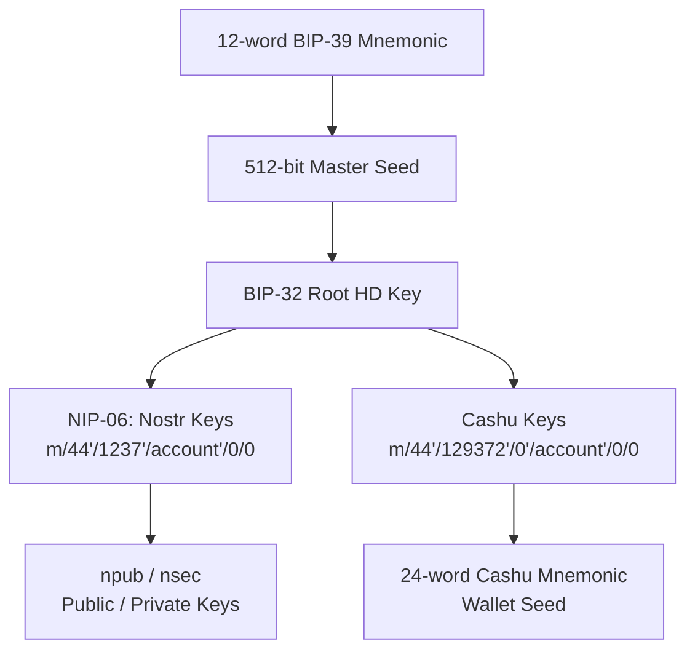

Sovran uses industry-standard cryptographic key derivation from a single BIP-39 mnemonic seed phrase. This page documents the technical implementation.

## Overview

All keys in Sovran are deterministically derived from a **12-word BIP-39 mnemonic** using standardized derivation paths:

<CardGroup cols={2}>
  <Card title="BIP-39" icon="key">
    12-word mnemonic seed phrase (128 bits entropy)
  </Card>
  <Card title="BIP-32" icon="diagram-project">
    Hierarchical Deterministic (HD) key derivation
  </Card>
  <Card title="NIP-06" icon="satellite-dish">
    Nostr key derivation from mnemonic
  </Card>
  <Card title="NUT-13" icon="coins">
    Cashu wallet derivation (unofficial)
  </Card>
</CardGroup>

## Key Derivation Architecture



## BIP-39 Mnemonic Generation

Sovran generates a **12-word mnemonic** (128 bits of entropy) for new wallets:

<CodeGroup>
```typescript Mnemonic Generation (helper/secureStorage.ts:80-95)
async function generateMnemonic(): Promise<string> {
  try {
    // Generate 128 bits of entropy (16 bytes) for a 12-word mnemonic
    const entropy = new Uint8Array(16);
    crypto.getRandomValues(entropy);

    // Generate mnemonic from entropy
    const mnemonic = bip39.entropyToMnemonic(entropy, wordlist);

    console.log('Generated new mnemonic');
    return mnemonic;
  } catch (error) {
    console.error('Failed to generate mnemonic:', error);
    throw new Error('Failed to generate mnemonic');
  }
}
```

```typescript Mnemonic Storage (helper/secureStorage.ts:36-57)
export async function storeMnemonic(mnemonic: string): Promise<boolean> {
  try {
    if (!mnemonic || typeof mnemonic !== 'string') {
      throw new Error('Invalid mnemonic provided');
    }

    // Validate it's a 12-word mnemonic
    const words = mnemonic.trim().split(' ');
    if (words.length !== 12) {
      throw new Error('Mnemonic must be exactly 12 words');
    }

    const options = Platform.OS === 'ios' ? IOS_SECURE_OPTIONS : {};
    await SecureStore.setItemAsync(STORAGE_KEYS.USER_MNEMONIC, mnemonic, options);

    return true;
  } catch (error) {
    console.error('Failed to store mnemonic:', error);
    return false;
  }
}
```
</CodeGroup>

### Secure Storage

Mnemonics are stored using `expo-secure-store`:

- **iOS**: Keychain Services (encrypted in Secure Enclave)
- **Android**: Keystore System (hardware-backed encryption)

<Info>
  The mnemonic never leaves secure storage except during key derivation operations.
</Info>

## Nostr Key Derivation (NIP-06)

Nostr keys follow **NIP-06** standard derivation:

### Derivation Path

```
m/44'/1237'/<account>'/0/0
```

- `44'`: BIP-44 purpose (HD wallets)
- `1237'`: Nostr coin type (registered in SLIP-0044)
- `<account>'`: Account index (default: 0)
- `0/0`: Change index / Address index (always 0 for Nostr)

### Implementation

<CodeGroup>
```typescript Nostr Key Derivation (helper/keyDerivation.ts:18-31)
export function deriveNostrKeys(mnemonic: string, accountIndex: number = 0): DerivedNostrKeys {
  const { privateKey: sk, publicKey: pk } = nip06.accountFromSeedWords(
    mnemonic,
    undefined,
    accountIndex
  );

  return {
    npub: nip19.npubEncode(pk),  // Bech32-encoded public key
    nsec: nip19.nsecEncode(sk),  // Bech32-encoded private key
    pubkey: pk,                   // Hex public key
    privateKey: sk,               // Raw private key bytes
  };
}
```

```typescript NostrKeysProvider Derivation (providers/NostrKeysProvider.tsx:131-156)
const deriveKeys = useCallback(
  async (accountIndex: number): Promise<NostrKeys | null> => {
    if (!mnemonic) {
      return null;
    }

    try {
      // Check cache first
      if (cachedKeys.has(accountIndex)) {
        return cachedKeys.get(accountIndex)!;
      }

      const derivedKeys: NostrKeys = deriveNostrKeys(mnemonic, accountIndex);

      // Cache the keys
      setCachedKeys((prev) => new Map(prev).set(accountIndex, derivedKeys));

      return derivedKeys;
    } catch (err) {
      const errorMessage = err instanceof Error ? err.message : 'Failed to derive Nostr keys';
      console.error('Failed to derive Nostr keys:', err);
      throw new Error(errorMessage);
    }
  },
  [mnemonic, cachedKeys]
);
```
</CodeGroup>

### Derived Key Formats

| Format | Description | Example |
|--------|-------------|----------|
| **npub** | Bech32 public key | `npub1abc...xyz` |
| **nsec** | Bech32 private key | `nsec1def...uvw` |
| **pubkey** | Hex public key (32 bytes) | `a1b2c3d4...` |
| **privateKey** | Raw bytes (32 bytes) | `Uint8Array(32)` |

## Cashu Wallet Derivation

Cashu wallets use a **custom derivation path** (not yet standardized in NUT-13):

### Derivation Path

```
m/44'/129372'/0'/<account>'/0/0
```

- `44'`: BIP-44 purpose
- `129372'`: Cashu coin type (unofficial, may change)
- `0'`: Wallet index (always 0)
- `<account>'`: Account index (matches Nostr account)
- `0/0`: Change / Address (always 0)

### Two-Stage Derivation

Cashu derivation is a **two-stage process**:

1. **Derive child private key** (32 bytes) from BIP-32 path
2. **Re-encode as BIP-39 mnemonic** (24 words) for Cashu wallet

<CodeGroup>
```typescript Cashu Mnemonic Derivation (helper/keyDerivation.ts:41-47)
const CASHU_DERIVATION_PREFIX = `m/44'/129372'`;

export function deriveCashuMnemonic(mnemonic: string, accountIndex: number = 0): string {
  const seed = bip39.mnemonicToSeedSync(mnemonic);
  const root = HDKey.fromMasterSeed(seed);
  const path = `${CASHU_DERIVATION_PREFIX}/0'/${accountIndex}'/0/0`;
  const child = root.derive(path);
  return bip39.entropyToMnemonic(child.privateKey as Uint8Array, wordlist);
}
```

```typescript Cashu Wallet Seed (helper/keyDerivation.ts:52-54)
export function deriveCashuWalletSeed(cashuMnemonic: string): Uint8Array {
  return bip39.mnemonicToSeedSync(cashuMnemonic, '');
}
```

```typescript Full Chain Derivation (helper/keyDerivation.ts:60-65)
export function deriveCashuWalletSeedFromRoot(
  mnemonic: string,
  accountIndex: number = 0
): Uint8Array {
  return deriveCashuWalletSeed(deriveCashuMnemonic(mnemonic, accountIndex));
}
```
</CodeGroup>

<Info>
  The Cashu mnemonic (24 words) is derived deterministically and can be re-derived from the root mnemonic at any time. It is **cached in secure storage** for performance.
</Info>

## Key Caching & Performance

To avoid expensive re-derivation, Sovran caches derived keys in **secure storage**:

### Cache Structure

```typescript Cache Types (helper/secureStorage.ts:16-22)
export interface CachedDerivedKeys {
  npub: string;
  nsec: string;
  pubkey: string;
  privateKeyHex: string;
  mnemonicHash: string;  // Fingerprint to detect mnemonic changes
}
```

### Cache Invalidation

Caches are invalidated when:

- Root mnemonic changes (detected via hash)
- User explicitly clears secure storage
- App is uninstalled

<CodeGroup>
```typescript Mnemonic Hash (helper/secureStorage.ts:179-185)
export function hashMnemonic(mnemonic: string): string {
  let hash = 0;
  for (let i = 0; i < mnemonic.length; i++) {
    hash = (hash * 31 + mnemonic.charCodeAt(i)) | 0;
  }
  return hash.toString(36);
}
```

```typescript Cache Read/Write (helper/secureStorage.ts:187-211)
export async function storeDerivedKeys(
  accountIndex: number,
  keys: CachedDerivedKeys
): Promise<boolean> {
  try {
    const options = Platform.OS === 'ios' ? IOS_SECURE_OPTIONS : {};
    await SecureStore.setItemAsync(derivedKeysKey(accountIndex), JSON.stringify(keys), options);
    return true;
  } catch (error) {
    console.error('Failed to store derived keys:', error);
    return false;
  }
}

export async function retrieveDerivedKeys(accountIndex: number): Promise<CachedDerivedKeys | null> {
  try {
    const options = Platform.OS === 'ios' ? IOS_SECURE_OPTIONS : {};
    const raw = await SecureStore.getItemAsync(derivedKeysKey(accountIndex), options);
    if (!raw) return null;
    return JSON.parse(raw) as CachedDerivedKeys;
  } catch (error) {
    console.error('Failed to retrieve derived keys:', error);
    return null;
  }
}
```
</CodeGroup>

### Fast Path vs Slow Path

From `providers/NostrKeysProvider.tsx:300-345`:

```typescript Cache Logic
const mHash = hashMnemonic(mnemonicToUse);

// Try loading cached keys from SecureStore (fast path)
const [cachedDerived, cachedCashu] = await Promise.all([
  retrieveDerivedKeys(defaultAccountIndex),
  retrieveCashuMnemonic(defaultAccountIndex),
]);

const cacheValid =
  cachedDerived?.mnemonicHash === mHash && cachedCashu?.mnemonicHash === mHash;

if (cacheValid && cachedDerived && cachedCashu) {
  // Fast path: use cached keys
  defaultKeys = {
    npub: cachedDerived.npub,
    nsec: cachedDerived.nsec,
    pubkey: cachedDerived.pubkey,
    privateKey: hexToBytes(cachedDerived.privateKeyHex),
  };
  defaultCashuMnemonic = cachedCashu.value;
} else {
  // Slow path: derive from scratch and persist to SecureStore
  defaultKeys = deriveNostrKeys(mnemonicToUse, defaultAccountIndex);
  defaultCashuMnemonic = deriveCashuMnemonicPure(mnemonicToUse, defaultAccountIndex);

  // Persist to SecureStore in the background (don't block)
  const cachePayload: CachedDerivedKeys = {
    npub: defaultKeys.npub,
    nsec: defaultKeys.nsec,
    pubkey: defaultKeys.pubkey,
    privateKeyHex: bytesToHex(defaultKeys.privateKey),
    mnemonicHash: mHash,
  };
  Promise.all([
    storeDerivedKeys(defaultAccountIndex, cachePayload),
    storeCashuMnemonic(defaultAccountIndex, defaultCashuMnemonic, mHash),
  ]);
}
```

## Multi-Account Support

Sovran supports multiple accounts (profiles) from a single mnemonic:

```typescript Account Derivation
// Account 0 (default)
Nostr: m/44'/1237'/0'/0/0
Cashu: m/44'/129372'/0'/0'/0/0

// Account 1
Nostr: m/44'/1237'/1'/0/0
Cashu: m/44'/129372'/0'/1'/0/0

// Account 2
Nostr: m/44'/1237'/2'/0/0
Cashu: m/44'/129372'/0'/2'/0/0
```

Each account has:
- Unique Nostr identity (different npub/nsec)
- Separate Cashu wallet (different ecash proofs)
- Independent mint trust lists
- Isolated transaction histories

<Info>
  See [Multi-Account](/features/multi-account) for user-facing documentation.
</Info>

## Security Considerations

### Mnemonic Entropy

- **12 words** = 128 bits entropy = 2^128 possible seeds
- Cryptographically secure randomness via `crypto.getRandomValues()`
- Wordlist: BIP-39 English (2048 words)

### Key Storage

<Check>Mnemonic stored in device secure enclave (iOS Keychain / Android Keystore)</Check>
<Check>Derived keys cached in secure storage with mnemonic hash validation</Check>
<Check>Private keys never leave secure storage except for signing operations</Check>
<Check>No keys transmitted over network</Check>

### Attack Surface

<Warning>
  **Threats:**
  - Device compromise (malware, rooted/jailbroken device)
  - Physical access to unlocked device
  - Side-channel attacks during derivation
  - Weak device passcode (brute-force secure storage)
</Warning>

<Check>
  **Mitigations:**
  - Hardware-backed encryption (Secure Enclave / Keystore)
  - Passcode lock (app-level protection)
  - No cloud backups of keys
  - Open source code (auditable)
</Check>

## Standards Compliance

| Standard | Purpose | Compliance |
|----------|---------|------------|
| **BIP-39** | Mnemonic generation | ✅ Full (12-word, English wordlist) |
| **BIP-32** | HD key derivation | ✅ Full (@scure/bip32) |
| **BIP-44** | Multi-account hierarchy | ✅ Full (purpose = 44') |
| **NIP-06** | Nostr key derivation | ✅ Full (coin type 1237') |
| **NUT-13** | Cashu deterministic secrets | ⚠️ Partial (custom path, subject to change) |
| **SLIP-0044** | Coin type registry | ✅ Registered (Nostr = 1237) |

<Note>
  Cashu derivation path (`m/44'/129372'/0'/<account>'/0/0`) is **not yet standardized** in NUT-13. This may change in future versions.
</Note>

## Code References

<CardGroup cols={2}>
  <Card title="keyDerivation.ts" icon="code" href="https://github.com/sovranBitcoin/sovran/blob/main/helper/keyDerivation.ts">
    Core derivation functions (NIP-06, Cashu)
  </Card>
  <Card title="secureStorage.ts" icon="code" href="https://github.com/sovranBitcoin/sovran/blob/main/helper/secureStorage.ts">
    Mnemonic storage and caching
  </Card>
  <Card title="NostrKeysProvider.tsx" icon="code" href="https://github.com/sovranBitcoin/sovran/blob/main/providers/NostrKeysProvider.tsx">
    Key derivation orchestration
  </Card>
  <Card title="useSecureStore.ts" icon="code" href="https://github.com/sovranBitcoin/sovran/blob/main/hooks/useSecureStore.ts">
    React hooks for secure storage
  </Card>
</CardGroup>

## Related Documentation

<CardGroup cols={2}>
  <Card title="Wallet Recovery" icon="rotate-left" href="/security/wallet-recovery">
    Restore wallet from seed phrase
  </Card>
  <Card title="Multi-Account" icon="users" href="/features/multi-account">
    Using multiple accounts from one seed
  </Card>
</CardGroup>